# Experiment Report — [10][TV2]: Depth Sweep & Capacity Curves (Underfitting / Overfitting Analysis)

> **Dataset**: UCI Letter Recognition (Clean Stratified Split: Train 14,934 samples / Test 3,734 samples)  
> **Protocol**: `test_size=0.20`, `random_state=42`, `stratify=True`  
> **Script**: [`scripts/run_depth_sweep_experiment.py`](file:///c:/Study/foundation_AI/Lab_2_DecisionTree/scripts/run_depth_sweep_experiment.py)  
> **Notebook**: [`notebooks/decision_tree/07_depth_sweep_experiment.ipynb`](file:///c:/Study/foundation_AI/Lab_2_DecisionTree/notebooks/decision_tree/07_depth_sweep_experiment.ipynb)  
> **Result JSON**: [`results/dt_letter_depth_sweep.json`](file:///c:/Study/foundation_AI/Lab_2_DecisionTree/results/dt_letter_depth_sweep.json)

---

## 1. Executive Summary

This report presents a comprehensive empirical capacity analysis of Decision Trees on the **UCI Letter Recognition dataset** by sweeping the maximum tree depth hyperparameter `max_depth` from $1$ to $35$ (and unconstrained $None$).

The objective is to map model complexity against generalization performance and explicitly delineate the three canonical model capacity regimes:
1. **Underfitting Region** ($\text{depth} \le 8$)
2. **Optimal Region** ($9 \le \text{depth} \le 18$)
3. **Overfitting Region** ($\text{depth} \ge 19$)

### Key Empirical Findings

> [!IMPORTANT]
> - **Global Peak Performance**: The optimal generalization performance occurs at **`max_depth=15–18`**, achieving a peak test accuracy of **87.68%** (error rate **12.32%**) and Macro-F1 of **87.73%**.
> - **Underfitting Boundary**: At `max_depth <= 8`, model capacity is severely constrained. Test accuracy ranges from a dismal **13.50%** (at depth 2) to **70.97%** (at depth 8).
> - **Overfitting & Noise Memorization**: At `max_depth >= 19`, train accuracy reaches **100.00%** (pure memorization), while test accuracy drops slightly from **87.68%** to **87.39%**, causing the generalization gap to expand to **12.61%**.
> - **Unconstrained Penalty**: Unpruned trees (`max_depth=None`, depth 31) perform worse on test data than regularized trees (`max_depth=15`), proving that hyperparameter depth constraints act as an effective structural regularizer.

---

## 2. Quantitative Benchmark Table

Below is the complete parameter sweep milestone table evaluated on the clean stratified split (`train.csv` / `test.csv`):

| `max_depth` | Criterion | Model Region | Train Accuracy | Test Accuracy | Error Rate | Train F1 | Test F1 | Generalization Gap | Leaf Count | Node Count | Fit Time (s) |
|---|---|---|---:|---:|---:|---:|---:|---:|---:|---:|---:|
| `1` | `entropy` | **Underfitting** | 0.0805 | 0.0801 | 0.9199 | 0.0115 | 0.0114 | +0.0004 | 2 | 3 | 0.0211 |
| `2` | `entropy` | **Underfitting** | 0.1349 | 0.1350 | 0.8650 | 0.0384 | 0.0384 | -0.0001 | 4 | 7 | 0.0253 |
| `5` | `entropy` | **Underfitting** | 0.4770 | 0.4759 | 0.5241 | 0.4735 | 0.4735 | +0.0011 | 32 | 63 | 0.0520 |
| `8` | `entropy` | **Underfitting** | 0.7320 | 0.7097 | 0.2903 | 0.7360 | 0.7143 | +0.0223 | 225 | 449 | 0.0762 |
| `10` | `entropy` | **Optimal** | 0.8415 | 0.7788 | 0.2212 | 0.8427 | 0.7787 | +0.0627 | 506 | 1,011 | 0.0881 |
| `12` | `entropy` | **Optimal** | 0.9428 | 0.8589 | 0.1411 | 0.9431 | 0.8592 | +0.0840 | 1,172 | 2,343 | 0.1034 |
| `15` | `entropy` | **Optimal** | **0.9952** | **0.8768** | **0.1232** | **0.9951** | **0.8766** | **+0.1184** | **1,722** | **3,443** | **0.1165** |
| `18` | `entropy` | **Optimal** | **0.9997** | **0.8768** | **0.1232** | **0.9997** | **0.8773** | **+0.1229** | **1,791** | **3,581** | **0.1211** |
| `20` | `entropy` | **Overfitting** | 1.0000 | 0.8739 | 0.1261 | 1.0000 | 0.8737 | +0.1261 | 1,796 | 3,591 | 0.1240 |
| `25` | `entropy` | **Overfitting** | 1.0000 | 0.8739 | 0.1261 | 1.0000 | 0.8737 | +0.1261 | 1,796 | 3,591 | 0.1252 |
| `None` | `entropy` | **Overfitting** | 1.0000 | 0.8739 | 0.1261 | 1.0000 | 0.8737 | +0.1261 | 1,796 | 3,591 | 0.1268 |

---

## 3. Detailed Region Identification & Phase Transitions

```mermaid
graph LR
    subgraph Underfitting ["1. Underfitting Region (Depth 1 to 8)"]
        U1["Train Acc <= 73.2%"]
        U2["Test Acc <= 70.97%"]
        U3["Small Gap (< 2.2%)"]
    end
    subgraph Optimal ["2. Optimal Region (Depth 9 to 18)"]
        O1["Peak Test Acc = 87.68%"]
        O2["Peak Macro F1 = 87.73%"]
        O3["Controlled Gap (8.4% to 12.3%)"]
    end
    subgraph Overfitting ["3. Overfitting Region (Depth >= 19)"]
        OV1["Train Acc = 100.0%"]
        OV2["Test Acc drops to 87.39%"]
        OV3["Widening Gap = 12.61%"]
    end
    Underfitting -->|Increase Depth| Optimal
    Optimal -->|Excessive Depth| Overfitting
```

### 1. Underfitting Region ($\text{max\_depth} \le 8$)
- **Characteristics**: Both train and test accuracies are unacceptably low ($\le 70.97\%$).
- **Root Cause**: The decision tree is forced to terminate before it can isolate feature combinations necessary to discriminate between 26 letter classes.
- **Generalization Gap**: Very small ($+0.0001$ to $+0.0223$), indicating high bias rather than variance.

### 2. Optimal Region ($9 \le \text{max\_depth} \le 18$)
- **Characteristics**: Test accuracy climbs rapidly to its maximum plateau (**87.68%** at `max_depth=15–18`).
- **Tradeoff**: Model capacity is sufficiently large to capture subtle non-linear boundaries while pruning unnecessary micro-branches.
- **Generalization Gap**: Moderate ($+0.0840$ to $+0.1229$).

### 3. Overfitting Region ($\text{max\_depth} \ge 19$)
- **Characteristics**: Training accuracy reaches absolute perfection (**100.00%**), while test accuracy decays by **0.29 percentage points** (from 87.68% down to 87.39%).
- **Root Cause**: Unconstrained leaves fit noise and individual outlier patterns in the 14,934 training samples.
- **Generalization Gap**: Expands to its maximum value (**12.61%**).

---

## 4. Visualizations & Capacity Curves

### A. Performance Curves & Region Shading

*Figure 1: Train vs. Test Accuracy, Macro-F1, Generalization Gap, and Leaf Growth across Max Depth.*

### B. Generalization Gap vs Model Complexity (Leaf Count)

*Figure 2: Scatter plot of Test Accuracy vs. Leaf Count with marker size proportional to Generalization Gap.*

### C. Pareto Frontier (Accuracy vs. Actual Tree Depth)

*Figure 3: Accuracy vs. Tree Depth Pareto curve highlighting peak performance points.*

---

## 5. Engineering Recommendations & Takeaways

1. **Optimal Hyperparameter Setting**: Set `max_depth=15` for Decision Trees on Letter Recognition. It yields the exact same peak accuracy (87.68%) as depth 18, but uses **69 fewer leaves** (1,722 vs 1,791), saving memory and inference latency.
2. **Never leave Decision Trees unconstrained**: Unpruned trees (`max_depth=None`) waste compute building 3,591 nodes while degrading test accuracy.
3. **Use Depth Constraints as First-Line Regularization**: Restricting `max_depth` to 15 eliminates overfitting without complex post-pruning algorithms.

---

## 6. Artifact Manifest

| Artifact Type | File Path | Description |
|---|---|---|
| **Python Script** | [`scripts/run_depth_sweep_experiment.py`](file:///c:/Study/foundation_AI/Lab_2_DecisionTree/scripts/run_depth_sweep_experiment.py) | Standalone depth sweep runner |
| **Jupyter Notebook** | [`notebooks/decision_tree/07_depth_sweep_experiment.ipynb`](file:///c:/Study/foundation_AI/Lab_2_DecisionTree/notebooks/decision_tree/07_depth_sweep_experiment.ipynb) | Interactive notebook analysis |
| **Result JSON** | [`results/dt_letter_depth_sweep.json`](file:///c:/Study/foundation_AI/Lab_2_DecisionTree/results/dt_letter_depth_sweep.json) | Schema v1.0 result JSON |
| **Summary CSV** | [`results/dt_letter_depth_sweep__summary.csv`](file:///c:/Study/foundation_AI/Lab_2_DecisionTree/results/dt_letter_depth_sweep__summary.csv) | Full tabular sweep metrics |
| **Figures** | [`figures/dt_depth_sweep__performance_curves.png`](file:///c:/Study/foundation_AI/Lab_2_DecisionTree/figures/dt_depth_sweep__performance_curves.png) [`figures/dt_depth_sweep__generalization_gap.png`](file:///c:/Study/foundation_AI/Lab_2_DecisionTree/figures/dt_depth_sweep__generalization_gap.png) [`figures/dt_depth_sweep__complexity_tradeoff.png`](file:///c:/Study/foundation_AI/Lab_2_DecisionTree/figures/dt_depth_sweep__complexity_tradeoff.png) | Visualization figures |
