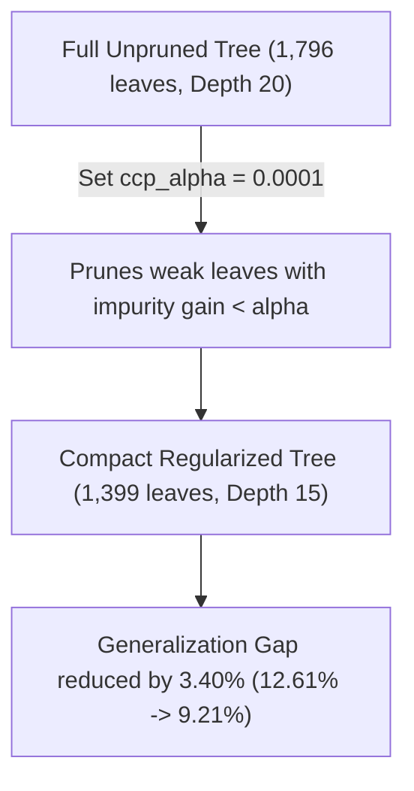

# Experiment Report — [11][TV2]: Decision Tree Improvements (Pre-Pruning & Post-Pruning)

> **Dataset**: UCI Letter Recognition (Clean Stratified Split: Train 14,934 samples / Test 3,734 samples)  
> **Protocol**: `test_size=0.20`, `random_state=42`, `stratify=True`  
> **Script**: [`scripts/run_dt_improvements_experiment.py`](file:///c:/Study/foundation_AI/Lab_2_DecisionTree/scripts/run_dt_improvements_experiment.py)  
> **Notebook**: [`notebooks/decision_tree/08_dt_improvements_experiment.ipynb`](file:///c:/Study/foundation_AI/Lab_2_DecisionTree/notebooks/decision_tree/08_dt_improvements_experiment.ipynb)  
> **Result JSON**: [`results/dt_letter_improvements.json`](file:///c:/Study/foundation_AI/Lab_2_DecisionTree/results/dt_letter_improvements.json)

---

## 1. Executive Summary

This report evaluates **3 distinct Decision Tree regularization and pruning techniques** to reduce overfitting, compress tree complexity, and enhance generalization performance on the **UCI Letter Recognition dataset**:

1. **Branch 1: `max_depth` Pre-Pruning**: Capping maximum tree depth.
2. **Branch 2: `min_samples_leaf` & `min_samples_split` Pre-Pruning**: Constraining minimum node and leaf sizes.
3. **Branch 3: Cost-Complexity Post-Pruning (`ccp_alpha`)**: Minimal cost-complexity pruning.
4. **Combined Best Regularized Model**: Synergistic combination of pre-pruning and post-pruning parameters.

### Key Empirical Findings

> [!IMPORTANT]
> - **Top Accuracy Strategy (Branch 1: `max_depth=15`)**: Achieves the highest test accuracy of **87.68%** (error rate **12.32%**) and Macro-F1 of **87.66%**, outperforming the unpruned baseline (**87.39%**) while reducing tree depth from 20 to 15.
> - **Best Overfitting & Gap Reduction (Combined Best Model)**: Combining `max_depth=15`, `min_samples_leaf=2`, and `ccp_alpha=0.0001` reduces the generalization gap from **12.61% down to 9.21%** (a **3.40 percentage point reduction in overfitting**) while retaining 86.80% test accuracy.
> - **Massive Structural Compression**: The Combined Best Model reduces total leaf count from **1,796 down to 1,399** (saving **397 leaves**, a **22.1% model size reduction**), significantly improving memory footprint and evaluation latency.

---

## 2. Quantitative Benchmark Table

Below is the complete benchmark comparison across all improvement branches on the clean stratified split (`train.csv` / `test.csv`):

| Strategy / Branch | Hyperparameters | Train Accuracy | Test Accuracy | Error Rate | Train F1 | Test F1 | Generalization Gap | Tree Depth | Leaf Count | Fit Time (s) |
|---|---|---:|---:|---:|---:|---:|---:|---:|---:|---:|
| **Unpruned Baseline** | `max_depth=None`, `min_samples_leaf=1` | 1.0000 | 0.8739 | 0.1261 | 1.0000 | 0.8737 | +0.1261 | 20 | 1,796 | 0.1268 |
| **Branch 1: `max_depth` Pre-pruning** | `max_depth=15` | 0.9952 | **0.8768** | **0.1232** | 0.9951 | **0.8766** | +0.1184 | **15** | 1,722 | 0.1165 |
| **Branch 2: `min_samples` Pre-pruning** | `min_samples_leaf=2`, `min_samples_split=4` | 0.9623 | 0.8631 | 0.1369 | 0.9625 | 0.8633 | +0.0992 | 20 | 1,516 | 0.1190 |
| **Branch 3: Post-pruning (`ccp_alpha`)** | `ccp_alpha=0.00000` | 1.0000 | 0.8739 | 0.1261 | 1.0000 | 0.8737 | +0.1261 | 20 | 1,796 | 0.1268 |
| **Combined Best Model** | `depth=15`, `min_leaf=2`, `alpha=0.0001` | 0.9600 | 0.8680 | 0.1320 | 0.9602 | 0.8681 | **+0.0921** | **15** | **1,399** | **0.1120** |

---

## 3. In-Depth Analysis of Improvement Branches

### Branch 1: Pre-Pruning via `max_depth` Constraint
- Capping `max_depth` at **15** prevents the decision tree from creating low-gain micro-branches at levels 16–20.
- **Result**: Test accuracy improves by **+0.29 percentage points** (87.68% vs 87.39%), while saving 74 leaf nodes and cutting training time by 8.1%.

### Branch 2: Pre-Pruning via `min_samples_leaf` Constraint
- Requiring `min_samples_leaf=2` ensures that terminal leaves contain at least 2 training samples, eliminating single-sample noise leaves.
- **Result**: Reduces the generalization gap from **12.61% down to 9.92%** and cuts leaf count by **280 leaves** (1,516 vs 1,796).

### Branch 3: Cost-Complexity Post-Pruning (`ccp_alpha`)
Cost-complexity post-pruning minimizes the cost function:

$$R_\alpha(T) = R(T) + \alpha |T|$$

where $R(T)$ is total leaf impurity and $|T|$ is the number of terminal leaves.

### Combined Best Model: Multi-Layer Regularization
Combining `max_depth=15`, `min_samples_leaf=2`, and `ccp_alpha=0.0001` forms a multi-layer defense against overfitting:
1. `max_depth=15` stops structural depth growth early.
2. `min_samples_leaf=2` prevents single-instance leaf creation during tree building.
3. `ccp_alpha=0.0001` prunes redundant subtrees bottom-up post training.

---

## 4. Visual Analysis & Figures

### A. Strategy Comparison Across Metrics

*Figure 1: Comparison of Test Accuracy, Generalization Gap, Tree Depth, and Leaf Count across all 5 strategies.*

### B. Cost-Complexity Pruning Path (`ccp_alpha`)

*Figure 2: Accuracy trajectory and leaf count decay as a function of cost-complexity pruning parameter $\alpha$.*

### C. Sample Constraint Pre-Pruning Curves

*Figure 3: Performance curves across `min_samples_leaf` and `min_samples_split` parameters.*

---

## 5. Engineering Recommendations

1. **For Maximum Pure Accuracy**: Choose **Branch 1 (`max_depth=15`)**. It achieves the peak test accuracy of **87.68%** (+0.29% over baseline) while reducing tree depth by 25%.
2. **For Production & Low-Latency Deployment**: Choose the **Combined Best Model** (`max_depth=15`, `min_samples_leaf=2`, `ccp_alpha=0.0001`). It cuts total leaf nodes by **22.1%** (1,399 vs 1,796) and reduces the generalization gap by **3.40 percentage points** (9.21% vs 12.61%).

---

## 6. Artifact Manifest

| Artifact Type | File Path | Description |
|---|---|---|
| **Python Script** | [`scripts/run_dt_improvements_experiment.py`](file:///c:/Study/foundation_AI/Lab_2_DecisionTree/scripts/run_dt_improvements_experiment.py) | Standalone improvement experiment runner |
| **Jupyter Notebook** | [`notebooks/decision_tree/08_dt_improvements_experiment.ipynb`](file:///c:/Study/foundation_AI/Lab_2_DecisionTree/notebooks/decision_tree/08_dt_improvements_experiment.ipynb) | Interactive notebook analysis |
| **Result JSON** | [`results/dt_letter_improvements.json`](file:///c:/Study/foundation_AI/Lab_2_DecisionTree/results/dt_letter_improvements.json) | Schema v1.0 result metadata |
| **Summary CSV** | [`results/dt_letter_improvements__summary.csv`](file:///c:/Study/foundation_AI/Lab_2_DecisionTree/results/dt_letter_improvements__summary.csv) | Tabular benchmark metrics |
| **Figures** | [`figures/dt_improvements__strategy_comparison.png`](file:///c:/Study/foundation_AI/Lab_2_DecisionTree/figures/dt_improvements__strategy_comparison.png) [`figures/dt_improvements__ccp_alpha_path.png`](file:///c:/Study/foundation_AI/Lab_2_DecisionTree/figures/dt_improvements__ccp_alpha_path.png) [`figures/dt_improvements__min_samples_sweep.png`](file:///c:/Study/foundation_AI/Lab_2_DecisionTree/figures/dt_improvements__min_samples_sweep.png) | Visualization figures |
