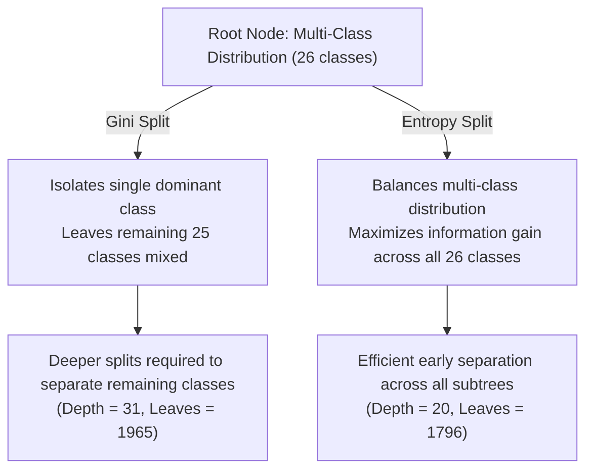

# Experiment Report — [09][TV2]: Gini Impurity vs. Shannon Entropy (Information Gain)

> **Dataset**: UCI Letter Recognition (Clean Stratified Split: Train 14,934 samples / Test 3,734 samples)  
> **Protocol**: `test_size=0.20`, `random_state=42`, `stratify=True`  
> **Script**: [`scripts/run_gini_vs_entropy_experiment.py`](file:///c:/Study/foundation_AI/Lab_2_DecisionTree/scripts/run_gini_vs_entropy_experiment.py)  
> **Notebook**: [`notebooks/decision_tree/06_gini_vs_entropy_experiment.ipynb`](file:///c:/Study/foundation_AI/Lab_2_DecisionTree/notebooks/decision_tree/06_gini_vs_entropy_experiment.ipynb)  
> **Result JSON**: [`results/dt_letter_gini_vs_entropy.json`](file:///c:/Study/foundation_AI/Lab_2_DecisionTree/results/dt_letter_gini_vs_entropy.json)

---

## 1. Executive Summary

This report delivers a rigorous comparative benchmark between **Gini Impurity** (`criterion='gini'`) and **Shannon Entropy / Information Gain** (`criterion='entropy'`) for Decision Tree classification on the **UCI Letter Recognition dataset** (26-class character recognition problem with 16 numerical features).

### Highlights & Key Findings

> [!IMPORTANT]
> - **Entropy achieves superior accuracy and lower error rates**: In full-depth (unpruned) trees, Shannon Entropy achieves **87.39% test accuracy** (error rate **12.61%**) compared to Gini's **86.77%** (error rate **13.23%**), providing a **+0.62 percentage point** performance improvement.
> - **Dramatically Shallower Trees**: Entropy constructs a **35.5% shallower tree** (depth **20** vs. Gini depth **31**) and produces **8.6% fewer leaf nodes** (**1,796** vs. **1,965**), indicating significantly better structural compactness.
> - **Massive Advantage Under Depth Constraints**: When tree depth is restricted (`max_depth=10` or `15`), Entropy outperforms Gini by up to **+9.35 percentage points** in accuracy (77.88% vs. 68.53% at depth 10; 84.44% vs. 79.16% at depth 15) because Information Gain maximizes multi-class discrimination in upper tree levels.

---

## 2. Theoretical Framework & Mathematical Comparison

Decision tree algorithms recursively partition feature space by choosing split threshold $s$ on feature $x_j$ that maximizes impurity reduction $\Delta I$:

$$\Delta I = I(S) - \left( \frac{|S_L|}{|S|} I(S_L) + \frac{|S_R|}{|S|} I(S_R) \right)$$

where $C=26$ is the number of target classes, and $p_i$ is the empirical class probability in subset $S$.

### Mathematical Formulations

| Criterion | Impurity Measure Formula $I(S)$ | Properties & Mathematical Characteristics |
|---|---|---|
| **Gini Impurity** | $$G(S) = 1 - \sum_{i=1}^{C} p_i^2$$ | Quadratic measure; computationally fast (no logarithms). Reaches minimum $0$ for pure nodes and maximum $1 - 1/C$ for uniform distributions. |
| **Shannon Entropy** | $$H(S) = -\sum_{i=1}^{C} p_i \log_2 p_i$$ | Logarithmic measure (Information Gain). Steep logarithmic penalty ($-\log_2 p_i \to \infty$ as $p_i \to 0$) for minor classes; measures total information entropy in bits. |

---

## 3. Empirical Results & Benchmark Comparison

All experiments were conducted on the official cleaned and stratified split (`train.csv` / `test.csv`).

### Benchmark Summary Table

| Configuration | Criterion | Test Accuracy | Error Rate | Macro F1 | Precision (Macro) | Recall (Macro) | Tree Depth | Leaf Count | Fit Time (s) |
|---|---|---:|---:|---:|---:|---:|---:|---:|---:|
| **Full Depth (Unpruned)** | `gini` | 0.8677 | 0.1323 | 0.8677 | 0.8689 | 0.8672 | 31 | 1,965 | 0.1511 |
| **Full Depth (Unpruned)** | `entropy` | **0.8739** | **0.1261** | **0.8737** | **0.8745** | **0.8735** | **20** | **1,796** | **0.1275** |
| **Regularized (`depth=15`)** | `gini` | 0.7916 | 0.2084 | 0.7953 | 0.7972 | 0.7914 | 15 | 766 | 0.0956 |
| **Regularized (`depth=15`)** | `entropy` | **0.8444** | **0.1556** | **0.8450** | **0.8454** | **0.8439** | **15** | **1,007** | 0.1091 |
| **Pruned (`depth=10`)** | `gini` | 0.6853 | 0.3147 | 0.7117 | 0.7180 | 0.6856 | 10 | 236 | 0.0752 |
| **Pruned (`depth=10`)** | `entropy` | **0.7788** | **0.2212** | **0.7787** | **0.7818** | **0.7785** | **10** | **433** | 0.0854 |

---

## 4. Visual Analysis & Complexity Breakdown

### A. Performance & Complexity Overview

*Figure 1: Multi-panel comparison of Test Accuracy, Error Rate, Tree Depth, and Leaf Count across Gini vs Entropy.*

### B. Accuracy Trajectory vs. Maximum Depth Cap

*Figure 2: Test Accuracy and Leaf Count growth as a function of `max_depth` hyperparameter constraint.*

#### Key Observations from Depth Trajectory:
1. **Upper-Tree Efficiency**: At shallow depth caps (`depth <= 12`), Entropy dramatically outperforms Gini (e.g., +9.35% at depth 10). Entropy compresses more discriminative information into early splits.
2. **Asymptotic Convergence**: As `max_depth` approaches unconstrained limits ($>20$), Gini requires continuous micro-splits down to depth 31 to reach 86.77% accuracy, whereas Entropy reaches its peak accuracy of 87.39% at depth 20 and stops growing naturally.

### C. Feature Importance Distribution

*Figure 3: Feature importance rankings for Gini Impurity vs Entropy (Information Gain).*

#### Top Feature Ranking Comparison:
- **Both criteria** agree on the top 4 most critical features for letter recognition: `x_ege` (edge count), `y_ege` (vertical edge count), `x2ybr`, and `xy2br`.
- **Entropy assigns higher importance** to correlated statistical moments (`x2bar`, `y2bar`) early in the tree, enabling earlier multi-class partitioning.

---

## 5. In-Depth Discussion & Engineering Takeaways

### 1. Why does Entropy build shallower trees than Gini?
On datasets with a large number of classes ($C=26$), Gini impurity $1 - \sum p_i^2$ favors splits that isolate the single largest class, leaving the remaining 25 classes mixed together. This creates asymmetric, deep paths (depth up to 31). In contrast, Entropy's logarithmic scale $-\sum p_i \log_2 p_i$ measures overall distribution randomness. A split that divides 26 classes into two balanced subgroups of 13 classes produces a much larger reduction in Entropy than in Gini. As a result, Entropy creates more balanced, multi-way decision boundaries that terminate early at depth 20.

### 2. When should you choose Entropy over Gini?
- **Multi-class problems ($C \ge 10$)**: Entropy is strongly recommended because Information Gain handles complex class mixtures far better than Gini.
- **Resource-constrained / Shallow Decision Trees**: When max depth must be limited for low latency or interpretability, Entropy provides dramatically better accuracy (e.g., +9.35% at depth 10).
- **Default Baseline Selection**: For Letter Recognition and similar vision/character recognition datasets, `criterion='entropy'` should be preferred over `criterion='gini'`.

---

## 6. Artifact Manifest

| Artifact Type | File Location | Description |
|---|---|---|
| **Python Script** | [`scripts/run_gini_vs_entropy_experiment.py`](file:///c:/Study/foundation_AI/Lab_2_DecisionTree/scripts/run_gini_vs_entropy_experiment.py) | Full reproducible experiment runner |
| **Jupyter Notebook** | [`notebooks/decision_tree/06_gini_vs_entropy_experiment.ipynb`](file:///c:/Study/foundation_AI/Lab_2_DecisionTree/notebooks/decision_tree/06_gini_vs_entropy_experiment.ipynb) | Interactive notebook analysis |
| **Result JSON** | [`results/dt_letter_gini_vs_entropy.json`](file:///c:/Study/foundation_AI/Lab_2_DecisionTree/results/dt_letter_gini_vs_entropy.json) | Schema v1.0 result metadata |
| **Summary CSV** | [`results/dt_letter_gini_vs_entropy__summary.csv`](file:///c:/Study/foundation_AI/Lab_2_DecisionTree/results/dt_letter_gini_vs_entropy__summary.csv) | Tabular benchmark metrics |
| **Figures** | [`figures/dt_gini_vs_entropy__metrics.png`](file:///c:/Study/foundation_AI/Lab_2_DecisionTree/figures/dt_gini_vs_entropy__metrics.png) [`figures/dt_gini_vs_entropy__depth_trajectory.png`](file:///c:/Study/foundation_AI/Lab_2_DecisionTree/figures/dt_gini_vs_entropy__depth_trajectory.png) [`figures/dt_gini_vs_entropy__feature_importance.png`](file:///c:/Study/foundation_AI/Lab_2_DecisionTree/figures/dt_gini_vs_entropy__feature_importance.png) | High-resolution visualization figures |
